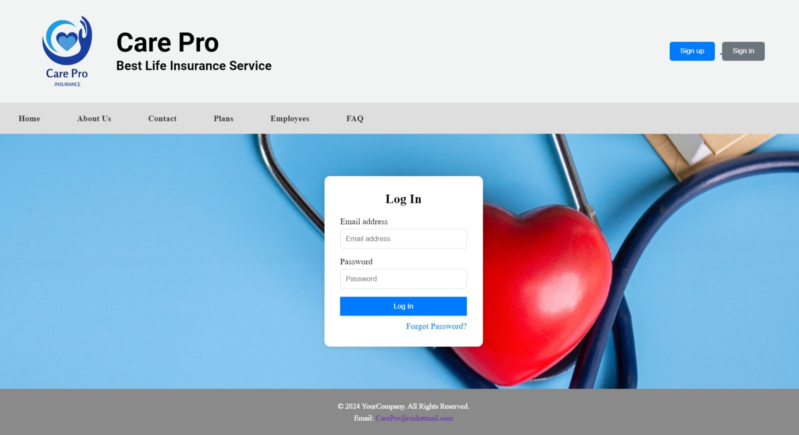
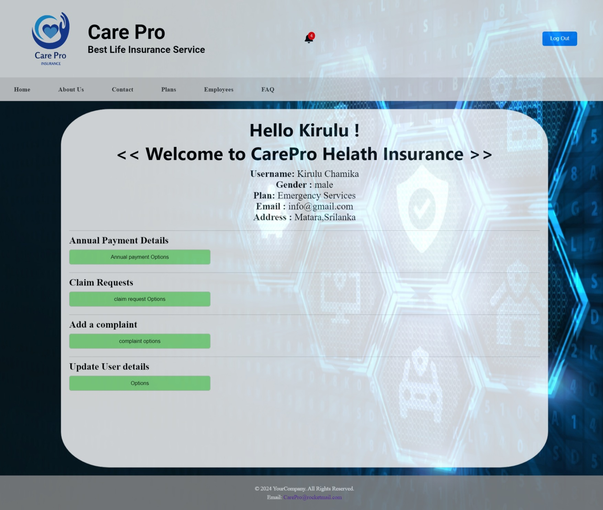
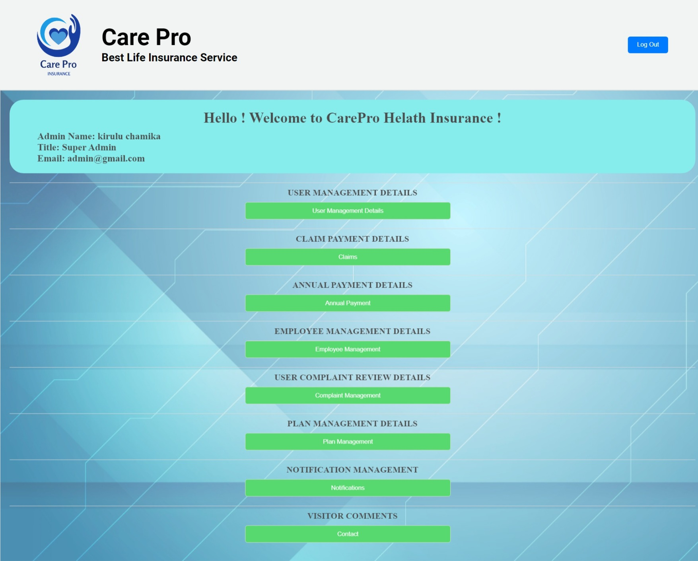
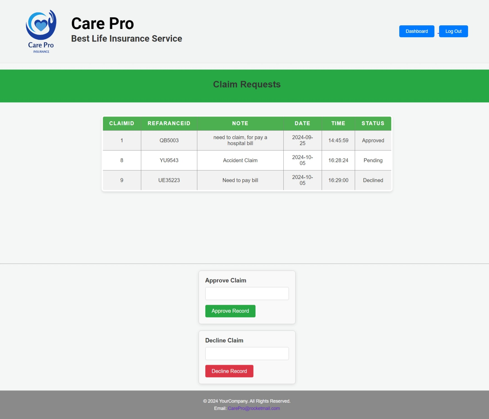
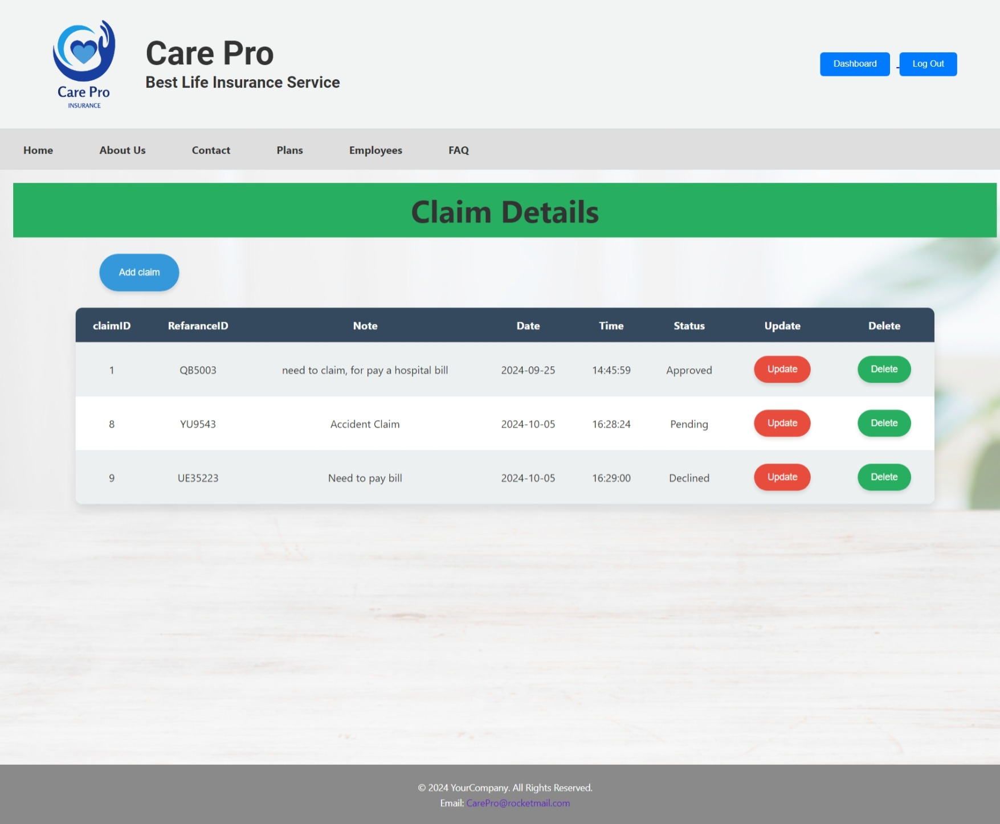

# University First year group project 

## CarePro Health Insurance Management System

This project was created for the Internet and Web Technologies (IWT) module during the second semester of our first year. It’s a dynamic web application developed using PHP, MySQL, HTML, JavaScript, and CSS to streamline health insurance management.

## Showcasing Our Work

_Welcome to CarePro — Home Page_

## Features Implemented

User Registration
_Allow new users to create accounts with basic information to access the system._

User Authentication
_Registered users can securely log into their accounts and explore the platform._

## Steps to Install and Run the Project Locally

1. Install a Local Server
    * Download and set up XAMPP or Laragon.
    * Ensure Apache and MySQL are running without issues.
2. Clone the Repository
    * Use Git or any preferred method to clone the project repository to your system.
3. Open the Project
    * Launch the folder in Visual Studio Code (VS Code) or any code editor of your choice.
4. Set Up the Database
    * Navigate to sql/carepro.sql.
    * Copy the provided SQL script.
    * Open your browser and go to localhost/phpmyadmin.
    * Create a database named  ' carepro ' and execute the SQL script.
    * Configure Database Connection
5. Go to inc/config.php.
Modify the `$password` variable as needed (leave it blank if your MySQL setup has no password).
6. Run the Application
    * Open your browser and go to localhost/<folder_name>/home.php (replace <folder_name> with the local folder name where the project is stored).

## Screenshots of the Web Application

    Login Page

_User log in page_

    Plans Page

_Plans page_

    User Dashboard

_User dashboard_

    Admin Dashboard

_Admin dashboard_

    Manage claim (Admin)

_Admin payment manage page_

    User claim Page

_User fee payment page_
